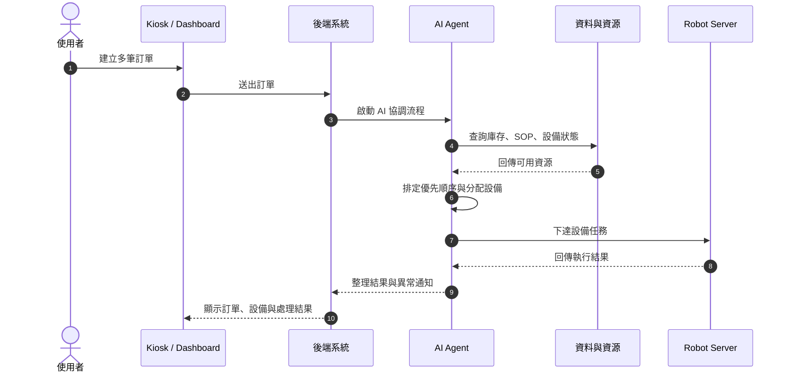

# AI Kitchen 多筆訂單協調流程

## 流程重點

- AI Agent 統整多筆訂單、庫存、SOP 與設備狀態。
- 依顧客需求決定優先順序。
- 將訂單分配給可用的炸鍋與機械手臂。
- Robot Server 執行任務，異常則通知相關人員。

```mermaid
sequenceDiagram
    autonumber
    actor U as 使用者
    participant F as Kiosk / Dashboard
    participant B as 後端系統
    participant A as AI Agent
    participant D as 資料與資源
    participant R as Robot Server

    U->>F: 建立多筆訂單
    F->>B: 送出訂單
    B->>A: 啟動 AI 協調流程
    A->>D: 查詢庫存、SOP、設備狀態
    D-->>A: 回傳可用資源
    A->>A: 排定優先順序與分配設備
    A->>R: 下達設備任務
    R-->>A: 回傳執行結果
    A-->>B: 整理結果與異常通知
    B-->>F: 顯示訂單、設備與處理結果
```

> AI Agent 的核心價值：在多筆訂單與有限設備下，自動完成判斷、排序、
> 設備分配與異常處理。
