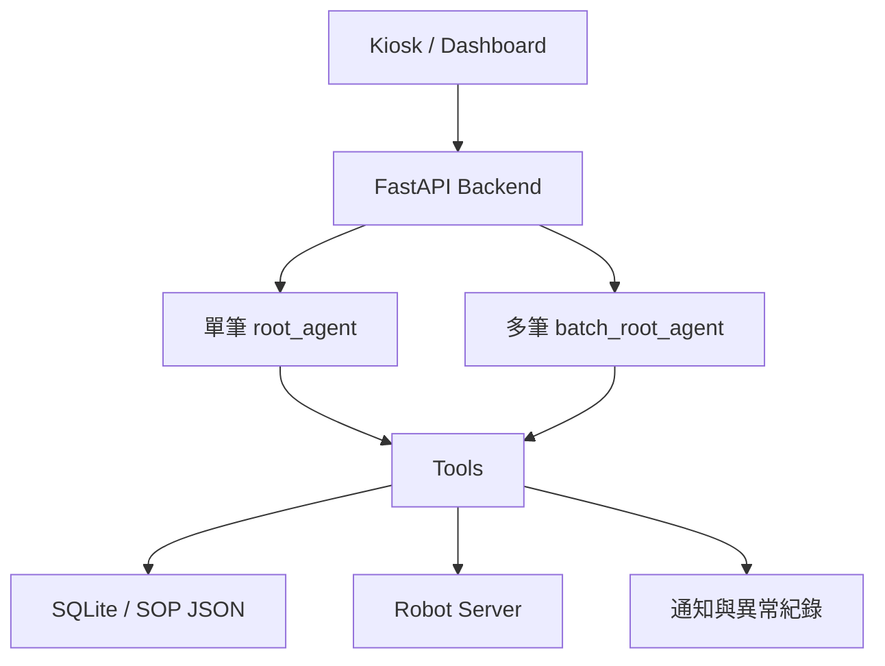
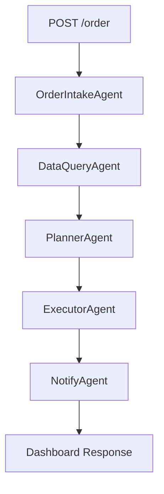
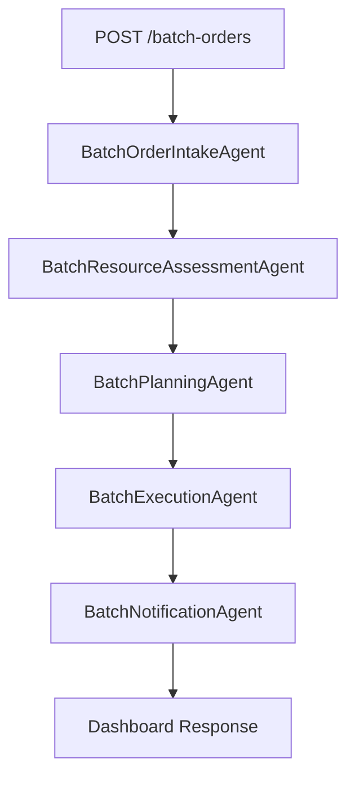

# AI Kitchen ADK 專案統整報告

> 報告日期：2026-06-15  
> 專案目錄：`ai_kitchen_adk`  
> 文件格式參考：[HackMD 每月報告模板](https://hackmd.io/@PzDfDv0UTfGNFw2TVXGE4Q/ByyWUpwZfg)

## 摘要

目前專案已完成一套以 Google ADK、FastAPI、SQLite 與 Robot Server
模擬器組成的 AI Kitchen Agent Demo。

系統同時支援：

1. 單筆訂單完整出餐流程。
2. 多筆訂單的優先排序、資源評估、設備分配、設備執行與異常通知。
3. 庫存不足、SOP 缺失、設備不可用與執行失敗等異常分流。
4. Dashboard 單筆／多筆模式切換。
5. SQLite logs、Agent session state 與 Robot Server history 的交叉驗證。

目前多筆訂單已可依照優先權建立 `execution_order`，並用 round-robin
方式將訂單分配給不同炸鍋與機械手臂。實際執行紀錄也證明 Robot Server
確實收到不同設備的任務。

目前仍屬 Demo 階段。設備任務雖然分配到不同設備，但 Robot Server
沒有真的等待 `duration_sec`，Agent 也仍按順序呼叫 Tool，因此尚未完成
真正的平行排程與設備鎖定。

---

## 一、專案情境

### 原始情境

專案初期以單筆炸物訂單為主：

```text
顧客下單
  ↓
理解偏好
  ↓
查庫存、設備與 SOP
  ↓
產生設備任務
  ↓
呼叫設備
  ↓
通知結果
```

這個流程可以展示 Agent 與 Tool Calling，但流程相對固定，容易由一般
後端程式取代，無法充分呈現 Agent 在不確定情境中的協調價值。

### 目前情境

目前情境已調整成中央廚房的多筆訂單協調：

```text
多筆訂單同時進入
  ↓
理解每筆訂單偏好與優先權
  ↓
逐筆檢查庫存與 SOP
  ↓
取得整體設備狀態
  ↓
判斷可執行、等待或升級處理
  ↓
建立執行順序並分配不同設備
  ↓
呼叫 Robot Server
  ↓
整理結果與異常通知
```

Agent 需要處理的資訊包含：

- 訂單品項與數量。
- 顧客偏好，例如酥一點、少油、趕時間。
- 訂單優先權。
- 庫存是否足夠。
- SOP 是否存在。
- 可用炸鍋與機械手臂。
- 設備分配與執行順序。
- 異常訂單的通知對象。

---

## 二、系統定位

本專案不是 OMP 的替代品，也沒有直接控制真實機械手臂。

目前定位是 OMP、Kiosk、Dashboard 與現場設備之間的 Agent
決策協調層：



各層責任如下：

| 層級 | 責任 |
|---|---|
| Dashboard | 建立訂單、切換情境、顯示決策與設備結果 |
| FastAPI | 提供 API、建立訂單 ID、呼叫 ADK workflow |
| ADK Agent | 理解、評估、排序、規劃、執行與分流 |
| Tools | 查資料、呼叫外部服務、寫入 logs |
| Robot Server | 模擬設備狀態與設備任務 |
| SQLite | 保存庫存、設備基本資料、訂單與執行紀錄 |

---

## 三、技術架構

### 核心技術

| 類別 | 技術 |
|---|---|
| Web API | FastAPI |
| Agent Framework | Google ADK |
| Model Adapter | LiteLLM |
| 目前模型 | `deepseek/deepseek-chat` |
| Database | SQLite |
| Frontend | HTML、CSS、Vanilla JavaScript |
| Equipment Simulator | 獨立 FastAPI Robot Server |
| Configuration | `.env`、`python-dotenv` |

### 主要目錄

```text
ai_kitchen_adk/
├── agents/                  # 單筆與多筆 Agent
├── tools/                   # Inventory、SOP、Robot、Alert 等工具
├── services/                # ADK Runner 與 JSON parser
├── data/                    # SOP templates
├── static/                  # Dashboard
├── tests/                   # 目前的手動測試腳本
├── debug_runs/              # 單筆 workflow debug 檔案
├── main.py                  # 主 FastAPI 服務
├── robot_server.py          # Robot Server 模擬器
├── database.py              # SQLite helpers
├── init_db.py               # Database schema 與初始資料
└── kitchen.db               # SQLite database
```

---

## 四、單筆訂單 Workflow

### 流程



`agents/root_agent.py` 使用 `SequentialAgent` 串接五個 Agent：

| Agent | 主要責任 | Tool |
|---|---|---|
| OrderIntakeAgent | 理解訂單、偏好與製作目標 | 無 |
| DataQueryAgent | 查庫存、設備與 SOP | Inventory、Equipment、SOP |
| PlannerAgent | 決定生產策略與設備任務 | 無 |
| ExecutorAgent | 呼叫 Robot Server 執行任務 | Robot Tool |
| NotifyAgent | 通知顧客與異常人員 | Notify、Alert |

### API

```http
POST /order
```

輸入範例：

```json
{
  "customer_id": "C001",
  "item_name": "雞排",
  "quantity": 1,
  "preference": "酥一點"
}
```

FastAPI 會建立 `ORD-xxxxxxxx`，執行 workflow，保存 debug 檔案並更新
訂單狀態。

---

## 五、多筆訂單 Batch Workflow

### 流程



### 目前實作的完整互動順序

手繪圖中的 `F → POS → DB → Backend → Agent → Robot` 概念接近實際情境，
但目前程式碼需要做以下校正：

1. 專案中沒有獨立的 POS service；Dashboard 會直接呼叫 FastAPI。
2. FastAPI 不會先從 DB 取出 batch 訂單；它會根據 request 建立
   `batch_id` 與每筆 `order_id`。
3. Agent 不直接操作 SQLite 或 Robot Server，而是透過 Tool。
4. 庫存由 Inventory Tool 查 SQLite。
5. SOP 由 SOP Tool 查詢 `data/sop_templates.json`，並將查詢結果寫入
   SQLite `task_logs`。
6. 設備狀態由 Equipment Tool 呼叫 Robot Server。
7. 設備任務由 Robot Tool 呼叫 Robot Server。
8. Robot 執行完成後，還會經過 BatchNotificationAgent 整理與通知，
   最後才由 FastAPI 回傳 Dashboard。

```mermaid
sequenceDiagram
    autonumber
    actor U as 使用者
    participant F as Dashboard<br/>static/index.html
    participant B as FastAPI Backend<br/>main.py
    participant R as ADK Runner<br/>services/adk_runner.py
    participant I as BatchOrderIntakeAgent
    participant A as BatchResourceAssessmentAgent
    participant P as BatchPlanningAgent
    participant E as BatchExecutionAgent
    participant N as BatchNotificationAgent
    participant IT as Inventory Tool
    participant ST as SOP Tool
    participant ET as Equipment Tool
    participant RT as Robot Tool
    participant AT as Alert Tool
    database DB as SQLite<br/>kitchen.db
    participant SJ as SOP JSON<br/>sop_templates.json
    participant RS as Robot Server<br/>127.0.0.1:9000

    U->>F: 輸入兩筆以上訂單
    F->>B: POST /batch-orders
    B->>B: 建立 batch_id 與 order_id
    B->>R: run_agent_with_state(batch_root_agent, batch_input)

    R->>I: 執行訂單整理
    I-->>R: batch_order_intake_state

    R->>A: 執行資源評估
    A->>ET: check_equipment(batch_id)
    ET->>RS: GET /device/status
    RS-->>ET: device_state
    ET->>DB: 寫入 check_equipment task log
    ET-->>A: equipment_snapshot

    loop 每一筆訂單
        A->>IT: check_inventory(order_id, item, quantity)
        IT->>DB: SELECT inventory
        DB-->>IT: stock result
        IT->>DB: 寫入 check_inventory task log
        IT-->>A: inventory_check

        A->>ST: get_sop(order_id, item, preference)
        ST->>SJ: 讀取 SOP template
        SJ-->>ST: SOP 與 preference rules
        ST->>DB: 寫入 get_sop task log
        ST-->>A: sop_check
    end

    A-->>R: batch_resource_assessment_state

    R->>P: 排優先順序與分配設備
    P->>P: 建立 decision、execution_order<br/>round-robin assigned_equipment
    P-->>R: batch_planning_state

    R->>E: 執行所有 auto_execute 訂單
    loop execution_order 中每筆 auto_execute 訂單
        loop 該訂單每一個 SOP step
            E->>RT: execute_robot_task(order_id, task)
            RT->>RS: POST /device/execute
            RS-->>RT: task execution result
            RT->>DB: 寫入 ExecutorAgent task log
            RT-->>E: step result
        end
    end
    E-->>R: batch_execution_state

    R->>N: 整理結果與異常通知
    opt 訂單需要內部通知或執行失敗
        N->>AT: send_internal_alert(...)
        AT->>DB: 寫入 alert_logs 與 task_logs
        AT-->>N: internal_alert
    end
    N-->>R: batch_final_state

    R-->>B: final_text + session_state
    B->>B: safe_json_loads(final_text)
    B-->>F: Batch JSON response
    F-->>U: 顯示排序、設備、執行與通知結果
```

`agents/batch_root_agent.py` 同時匯出：

```python
batch_root_agent = SequentialAgent(...)
root_agent = batch_root_agent
```

`batch_root_agent` 供 `main.py` 使用，`root_agent` 則供 Google ADK Web
辨識應用程式入口。

### Batch Agent 責任

| Agent | 主要責任 | Tool |
|---|---|---|
| BatchOrderIntakeAgent | 保留輸入順序、判斷優先權與偏好 | 無 |
| BatchResourceAssessmentAgent | 逐筆查庫存與 SOP，整批查一次設備 | Inventory、SOP、Equipment |
| BatchPlanningAgent | 決定 decision、execution order、設備與通知欄位 | 無 |
| BatchExecutionAgent | 依規劃呼叫所有可執行訂單的 SOP steps | Robot Tool |
| BatchNotificationAgent | 執行內部通知並整理最終結果 | Alert Tool |

### Session State

各階段透過 `output_key` 保存結果：

```text
batch_order_intake_state
batch_resource_assessment_state
batch_planning_state
batch_execution_state
batch_final_state
```

下一個 Agent 會從 instruction 中注入前一階段 state。

---

## 六、多筆訂單決策邏輯

### 優先權

目前 BatchOrderIntakeAgent 會根據顧客偏好判斷：

```text
包含「快」、「趕時間」或「趕車」 → high
其他情況                         → normal
```

偏好意圖包括：

```text
包含「酥」   → extra_crispy
包含「少油」 → less_oil
```

每筆訂單另有 `input_sequence`，用來在優先權相同時維持原始順序。

### Resource Status

每筆訂單的 `resource_status` 只描述庫存與 SOP：

| 條件 | resource_status |
|---|---|
| 庫存不足 | `inventory_blocked` |
| 庫存正常但 SOP 不存在 | `sop_blocked` |
| 庫存與 SOP 都正常 | `resource_ready` |

設備狀態獨立放在 `equipment_snapshot`，避免每筆資源狀態與整體設備狀態
混在一起。

### Decision

| 條件 | decision |
|---|---|
| 庫存不足 | `escalate_inventory` |
| SOP 不存在 | `escalate_sop` |
| 設備服務失敗或無法取得狀態 | `escalate_equipment` |
| 設備狀態正常但暫時沒有可用設備 | `wait_equipment` |
| 資源與設備都可用 | `auto_execute` |
| 必要欄位缺漏或資料矛盾 | `manual_review` |

### Execution Order

所有 `auto_execute` 訂單都會加入 `execution_order`：

1. `high` priority 優先。
2. priority 相同時依 `input_sequence`。
3. `sequence` 從 1 開始。
4. `selected_order_for_execution` 只表示第一順位，不代表只執行一筆。

---

## 七、多設備分配

目前 BatchPlanningAgent 已使用 round-robin 分配設備。

假設可用設備為：

```json
{
  "available_fryers": ["fryer_A", "fryer_C"],
  "available_robot_arms": ["robot_arm_1", "robot_arm_2"]
}
```

三筆訂單的分配會是：

| 順位 | 炸鍋 | 機械手臂 |
|---|---|---|
| 1 | fryer_A | robot_arm_1 |
| 2 | fryer_C | robot_arm_2 |
| 3 | fryer_A | robot_arm_1 |

最近一次 Robot Server history 已驗證：

```text
BATCH-50c24cb3-ORD-002 → fryer_A + robot_arm_1
BATCH-50c24cb3-ORD-001 → fryer_C + robot_arm_2
BATCH-50c24cb3-ORD-003 → fryer_A + robot_arm_1
```

每筆訂單均執行：

```text
S1 preheat_fryer
S2 place_food_into_fryer
S3 fry
S4 remove_food_from_fryer
```

### 目前限制

這是多設備「分配」，還不是真正的平行執行：

- BatchExecutionAgent 仍按 `execution_order` 呼叫 Tool。
- `execute_robot_task` 是同步 HTTP request。
- Robot Server 不會真的等待 `duration_sec`。
- Robot Server 沒有設備 reservation、busy lock 或排程佇列。

若要做到真實平行執行，需要在後端加入非同步任務、設備鎖定、開始／完成
時間與衝突檢查。

---

## 八、資料與工具設計

### Inventory Tool

檔案：`tools/inventory_tool.py`

```python
check_inventory(order_id, item_name, quantity)
```

只查詢指定品項，並將結果寫入 `task_logs`。

### SOP Tool

檔案：`tools/sop_tool.py`

SOP 由 `data/sop_templates.json` 提供，目前包含：

- 雞排
- 薯條
- 雞塊
- 甜不辣

每個 template 包含預熱、放入、炸製、取出時間及偏好規則。

### Equipment Tool

檔案：`tools/equipment_tool.py`

呼叫：

```http
GET http://127.0.0.1:9000/device/status
```

整理：

```text
available_fryers
available_robot_arms
device_state
```

### Robot Tool

檔案：`tools/robot_tool.py`

呼叫：

```http
POST http://127.0.0.1:9000/device/execute
```

每個 SOP step 都會轉成一個設備任務。

### Notify Tool

檔案：`tools/notify_tool.py`

用於單筆 workflow 的顧客通知模擬。

### Alert Tool

檔案：`tools/alert_tool.py`

用於內部異常通知，並寫入：

```text
alert_logs
task_logs
```

---

## 九、Database 設計

SQLite database 為 `kitchen.db`。

| Table | 用途 |
|---|---|
| orders | 單筆訂單與最終狀態 |
| inventory | 品項庫存 |
| equipment | 設備基本資料與 fallback 狀態 |
| task_logs | Agent／Tool 執行紀錄 |
| alert_logs | 內部異常通知紀錄 |

初始庫存包含：

```text
雞排 10
薯條 20
雞塊 15
甜不辣 12
花枝丸 12
```

其中花枝丸目前有庫存，但沒有 SOP template，因此可用來測試
`escalate_sop`。

注意：直接執行 `init_db.py` 會清空 orders、task_logs、alert_logs 與現有
測試資料，再重新建立初始狀態。

---

## 十、Robot Server

Robot Server 是獨立 FastAPI 服務，預設位址：

```text
http://127.0.0.1:9000
```

### 設備

```text
fryer_A
fryer_B
fryer_C
robot_arm_1
robot_arm_2
```

設備狀態：

```text
available
busy
maintenance
```

### API

| Method | Path | 用途 |
|---|---|---|
| GET | `/` | Health check |
| GET | `/device/status` | 查詢設備狀態 |
| POST | `/device/execute` | 執行設備任務 |
| POST | `/device/set-maintenance/{id}` | 設為維修 |
| POST | `/device/set-available/{id}` | 設為可用 |
| POST | `/device/reset` | 重設設備 |
| GET | `/device/history` | 查詢實際收到的任務 |

`/device/history` 是確認 Robot Server 是否真的收到指令的最佳證據。

---

## 十一、FastAPI API

### Workflow

| Method | Path | 用途 |
|---|---|---|
| GET | `/` | Dashboard |
| POST | `/order` | 單筆 Agent workflow |
| POST | `/batch-orders` | 多筆 Agent workflow |
| POST | `/demo/lunch-peak` | 固定尖峰多筆情境 |

### Demo Control

| Method | Path | 用途 |
|---|---|---|
| POST | `/demo/reset` | 恢復庫存與設備 |
| POST | `/demo/set-inventory-low` | 將雞排庫存設為 0 |
| POST | `/demo/set-equipment-down` | 將 fryer_A 設為 maintenance |
| GET | `/demo/status` | 顯示庫存與設備摘要 |

### Logs 與 Debug

| Method | Path | 用途 |
|---|---|---|
| GET | `/orders/{order_id}/logs` | 查詢 task logs |
| GET | `/orders/{order_id}/alerts` | 查詢 alert logs |
| GET | `/orders/{order_id}/debug` | 查詢 debug index |
| GET | `/orders/{order_id}/debug/{file}` | 查詢指定 debug 檔 |

---

## 十二、Dashboard

Dashboard 位於 `static/index.html`，由 `static/style.css` 提供樣式。

使用者可以：

- 新增或移除訂單。
- 選擇品項、數量與偏好。
- 一筆訂單自動走 `/order`。
- 兩筆以上自動走 `/batch-orders`。
- 切換正常、庫存不足與設備維修情境。
- 查看每筆 decision、原因、庫存、SOP、通知與設備分配。
- 查看目前可用設備與實際選擇設備。

近期已補上 batch 設備顯示：

- 蒐集所有訂單的 `assigned_equipment`。
- 在共用「設備選擇」區顯示所有已分配炸鍋與機械手臂。
- 使用 `equipment_snapshot.device_state` 更新設備狀態。

---

## 十三、JSON 與 State 穩定性

ADK instruction 中的單大括號會被視為 session state placeholder。

例如以下寫法會造成錯誤：

```text
task_id = "{order_id}-{step_id}"
```

因為 ADK 會嘗試尋找名為 `order_id` 的 context variable。

目前已改成自然語言範例：

```text
order_id 為 ORD-001、step_id 為 S1 時，
task_id 為 ORD-001-S1。
```

真正需要保留的 placeholders 是：

```text
{batch_order_intake_state}
{batch_resource_assessment_state}
{batch_planning_state}
{batch_execution_state}
```

`services/adk_runner.py` 的 `safe_json_loads` 也已改為掃描模型輸出中的合法
JSON objects，並選擇內容最大的 object，以處理模型偶爾輸出說明文字或
多段 JSON 的情況。

---

## 十四、如何驗證 Tool 與 Robot Server

不能只相信 Agent 最後輸出的文字，應交叉驗證三層資料。

### 1. Batch API execution result

確認：

```json
{
  "execution_result": {
    "execution_status": "completed",
    "results": []
  }
}
```

### 2. SQLite task logs

```http
GET /orders/{order_id}/logs
```

應看到 `ExecutorAgent` 的四個 SOP actions。

### 3. Robot Server history

```bash
curl http://127.0.0.1:9000/device/history
```

應確認以下欄位一致：

```text
order_id
task_id
device
action
success
```

只有 Robot Server history 有紀錄，才能確認 `/device/execute` 真的收到
HTTP request。

---

## 十五、啟動與測試方式

### 初始化資料庫

```bash
python init_db.py
```

### 啟動 Robot Server

```bash
uvicorn robot_server:app --host 0.0.0.0 --port 9000
```

### 啟動主服務

```bash
uvicorn main:app --host 0.0.0.0 --port 8000
```

### 開啟 Dashboard

```text
http://127.0.0.1:8000
```

### 測試多筆訂單

```bash
curl -X POST http://127.0.0.1:8000/batch-orders \
  -H "Content-Type: application/json" \
  -d '{
    "scenario": "custom_batch",
    "orders": [
      {
        "customer_id": "C001",
        "item_name": "雞排",
        "quantity": 1,
        "preference": "酥一點"
      },
      {
        "customer_id": "C002",
        "item_name": "甜不辣",
        "quantity": 3,
        "preference": "趕車，需要快一點"
      }
    ]
  }'
```

---

## 十六、目前完成項目

- 建立 FastAPI 主服務。
- 建立獨立 Robot Server。
- 建立 SQLite schema 與初始資料。
- 建立 data-driven SOP templates。
- 建立單筆 ADK SequentialAgent。
- 建立多筆 ADK SequentialAgent。
- 支援單筆訂單完整出餐流程。
- 支援多筆訂單優先排序。
- 支援所有可製作訂單進入 execution order。
- 支援多設備 round-robin 分配。
- 支援庫存不足、SOP 缺失與設備異常分流。
- 支援 Robot Server task history。
- 支援 task logs 與 alert logs。
- 支援單筆 workflow debug files。
- 支援 Dashboard 單筆與多筆模式切換。
- 支援 Dashboard 顯示 batch 設備分配。
- 改善 Agent 多段 JSON 的解析。
- 移除未被使用且功能重複的 `batch_coordinator_agent.py`。

---

## 十七、已知問題與技術債

### 高優先

1. **尚未真正平行執行**

   設備已分散分配，但 Tool 呼叫仍是順序執行。需要 async job、
   reservation 與設備鎖定。

2. **Robot Tool log status 可能錯誤**

   `tools/robot_tool.py` 最後寫入 `task_logs` 時目前固定使用
   `"success"`，即使 Robot Server 回傳 `success = false` 也可能被記成
   成功。應依 `result["success"]` 寫入 `success` 或 `failed`。

3. **缺少 Batch 自動化測試**

   現有 tests 只有單筆 Agent 腳本，尚未覆蓋：

   - priority sorting
   - round-robin assignment
   - mixed success／failure batch
   - skipped execution result
   - Robot Server failure

### 中優先

4. **目前沒有安裝 pytest**

   執行 `python -m pytest` 會得到 `No module named pytest`。

5. **既有測試 import 路徑已過期**

   測試仍引用：

   ```python
   from agents.adk_runner import ...
   ```

   但目前 Runner 位於：

   ```python
   from services.adk_runner import ...
   ```

6. **測試檔案有文字編碼異常**

   多個測試資料的中文已變成亂碼，需要以 UTF-8 重新保存。

7. **`config.py` 安全模型分支變數錯誤**

   `USE_ADK_WEB_SAFE_MODEL = True` 時，目前設定的是非預期變數名稱，
   沒有正確指定 `MODEL`。

8. **Batch API docstring 未列出 BatchExecutionAgent**

   實際 workflow 有五個子 Agent，但 `/batch-orders` docstring 只列出
   Intake、Resource、Planning、Notification。

### 低優先

9. `requirement.txt` 建議改名為標準的 `requirements.txt`。
10. `pos_tool.py` 目前沒有實作內容。
11. 部分 Python comments／docstrings 有編碼亂碼。
12. 前端存在重複 `</main>` 標籤，應整理 HTML 結構。
13. Batch workflow 目前只在 API response 提供 state flags，尚未像單筆
    workflow 一樣產生完整逐階段 debug files。

---

## 十八、下一階段建議

### 第一階段：穩定性

1. 修正 Robot Tool log status。
2. 修正 `config.py` MODEL 分支。
3. 修正 tests import 與 UTF-8 編碼。
4. 加入 `pytest` 與 deterministic unit tests。
5. 為 Agent 輸出增加 Pydantic schema 驗證。

### 第二階段：真正設備排程

1. 建立設備 reservation。
2. 增加設備 `busy_until`。
3. 依 SOP duration 計算排程。
4. 將不同設備組的訂單交給 async workers。
5. 記錄 planned start、actual start、finish time。
6. 防止同一設備同時執行兩個任務。

### 第三階段：營運能力

1. 扣除實際庫存。
2. 支援取消訂單與重排。
3. 支援訂單 SLA 與預估完成時間。
4. 支援設備故障後重新分派。
5. 支援 OMP／POS 真實 API。
6. 建立 batch execution timeline。

---

## 十九、目前可展示情境

### 情境 1：單筆正常製作

```text
雞排 1 份，酥一點
```

展示偏好理解、SOP 調整、設備執行與顧客通知。

### 情境 2：單筆 SOP 缺失

```text
花枝丸 1 份
```

庫存存在但 SOP 不存在，應停止設備任務並通知營運人員。

### 情境 3：多筆優先排序

```text
雞排：normal
甜不辣，趕車：high
```

展示 high priority 訂單優先進入 execution order。

### 情境 4：多設備輪派

使用三筆可製作訂單與兩組可用設備，展示：

```text
第 1 筆 → fryer_A + robot_arm_1
第 2 筆 → fryer_C + robot_arm_2
第 3 筆 → fryer_A + robot_arm_1
```

### 情境 5：部分訂單異常

```text
雞排：可製作
不存在品項：庫存或 SOP 失敗
```

展示正常訂單繼續執行、異常訂單獨立分流。

---

## 二十、結論

目前專案已從固定的單筆 Tool Calling Demo，發展為具備多筆訂單理解、
優先排序、資源評估、設備分配、實際 Tool 執行與異常通知的中央廚房
Agent 協調雛形。

目前最具代表性的成果是：

1. 單筆與多筆都使用 Google ADK SequentialAgent。
2. 多筆流程不是只選一筆，而是處理所有可製作訂單。
3. 訂單可依顧客需求重新排序。
4. 多台設備可用時，會以 round-robin 分散設備。
5. Robot Server history 可證明設備 API 確實被呼叫。
6. 異常訂單不會拖垮整批流程，而是獨立分流通知。

下一步的重點不應只是增加更多 Agent，而是將目前的設備分配升級為具備
時間、鎖定、併發與失敗重排能力的真實排程模型。
